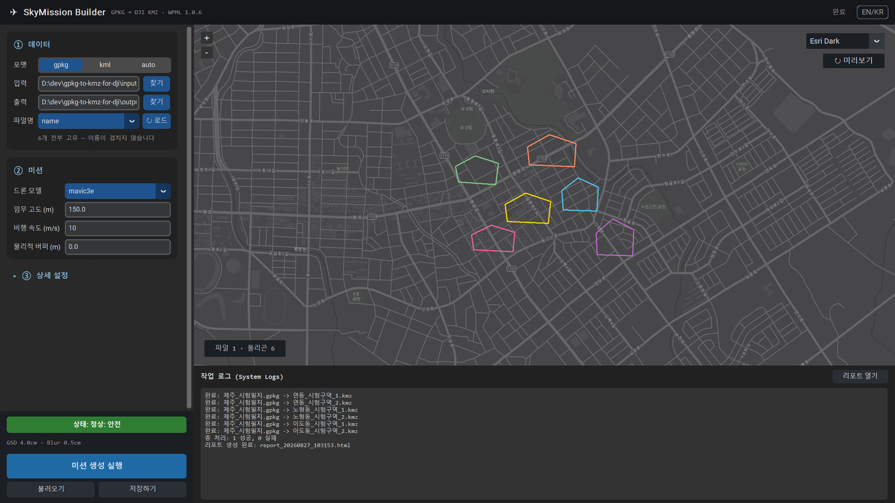
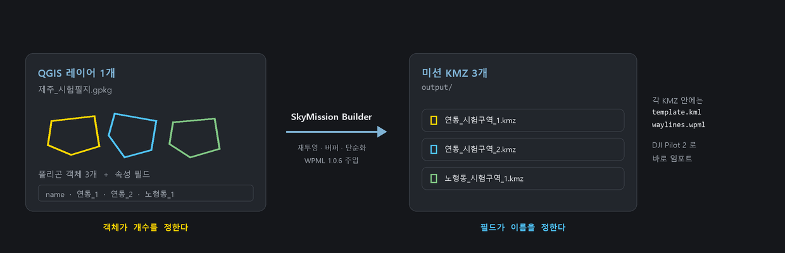
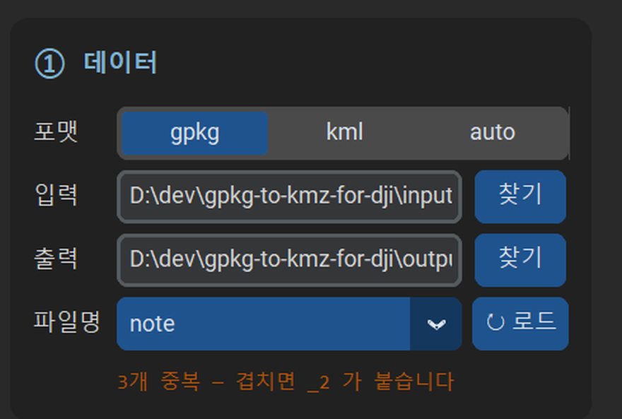

# SkyMission Builder

**QGIS 폴리곤을 DJI 드론 임무 파일(KMZ)로 대량 변환하는 데스크톱 도구.**
필지 83개짜리 GPKG 한 장이 0.4초 만에 KMZ 83개가 됩니다.

<p align="center">
  
</p>

---

## 이 도구가 하는 일

QGIS에서 **레이어 하나**로 만든 GPKG를 넣으면, 그 안의 **폴리곤 객체마다 임무 KMZ를 하나씩** 만듭니다.
파일 이름은 지정한 **속성 필드값**으로 붙습니다.

<p align="center">
  
</p>

| 무엇이 | 무엇을 정하는가 |
|---|---|
| **폴리곤 객체** | 미션이 **몇 개** 생기는가 (점·선 객체는 자동으로 건너뜁니다) |
| **속성 필드** | 각 파일의 **이름** (예: `ADDRE_1_2` → `구좌읍김녕리158.kmz`) |

출력은 DJI **WPML 1.0.6** 표준을 따르며, KMZ 안에는 `template.kml`과 `waylines.wpml`이 들어갑니다.

> **입력은 GPKG 또는 KML/KMZ입니다. Shapefile은 직접 읽지 못합니다** —
> QGIS에서 `내보내기 → 객체를 다른 이름으로 저장 → GeoPackage`로 변환한 뒤 넣어 주세요.

---

## 설치

Python 3.10 이상이 필요합니다.

```bash
pip install -r requirements.txt
```

지도 미리보기를 쓰려면 하나 더 설치합니다. **없어도 변환은 모두 동작하며**, 지도 자리에 안내 문구가 대신 표시됩니다.
다만 이 패키지 하나가 17개 패키지 43.9MB를 끌고 옵니다.

```bash
pip install -r requirements-optional.txt
```

필수 의존성은 `shapely` · `pyproj` · `customtkinter` 셋뿐입니다.
GPKG 읽기는 파이썬 표준 라이브러리 `sqlite3`가 담당합니다 —
GeoPandas·GDAL을 쓰지 않는 이유는 [의존성 다이어트](docs/dependency-diet.md)에 적어 두었습니다.

---

## 빠른 시작

```bash
python main.py
```

1. **① 데이터** — `input/` 폴더에 GPKG를 넣고, 포맷을 고른 뒤 **↻ 로드**를 눌러 파일명으로 쓸 필드를 선택합니다.
2. **② 미션** — 드론 모델·고도·속도를 정합니다. 왼쪽 아래 안전 표시가 실시간으로 판정을 보여 줍니다.
3. **미션 생성 실행** — `output/` 폴더에 KMZ가 하나씩 생기고, 작업 요약 HTML 리포트가 함께 만들어집니다.

지도에는 변환될 폴리곤이 색깔별로 미리 그려지고, 왼쪽 아래에 `파일 N · 폴리곤 M`이 표시됩니다.
**실행 전에 몇 개가 만들어질지** 눈으로 확인할 수 있습니다.

---

## ⚠️ 비행 전 반드시 확인하세요

생성된 KMZ의 `waylines.wpml`에는 **원본 템플릿 현장의 실행 웨이포인트가 그대로** 들어 있습니다.
임무 폴리곤은 `template.kml`에만 반영됩니다.

이 파일은 **DJI Pilot 2에서 불러와 경로를 재생성한 뒤 비행하는 것을 전제**로 합니다(`templateType = mapping2d`).
웨이라인을 직접 실행하면 임무 지역이 아니라 원본 현장을 비행하게 됩니다.

검사 도구가 이 간극을 재서 알려 줍니다.

```bash
python src/core/inspector.py output/어떤미션.kmz
```

```
KML ellipsoidHeight: 120.0
WPML executeHeight count: 26
GEO centroid distance: 39,399 m
!! 경고: 실행 웨이포인트(waylines.wpml)가 임무 폴리곤에서 39.4 km 떨어져 있습니다.
```

같은 설정이 KML과 WPML 두 파일에 따로 들어가므로, 이 도구는 두 값을 나란히 출력해 불일치를 눈으로 잡게 해 줍니다.

---

## 파일명 필드 고르기

이름이 겹치면 산출물을 잃을 수 있어, **고르는 자리에서 그 필드가 쓸 만한지 알려 줍니다.**

<p align="center">
  
</p>

- **전부 비어 있는 필드는 목록에 나오지 않습니다.** 고르면 산출물이 하나만 남기 때문입니다.
- 중복이 있으면 위와 같이 알려 주고, 실제로 겹칠 때는 `_2`, `_3`을 붙여 **하나도 잃지 않고** 저장합니다.
- 필드를 고르지 않으면(`(auto)`) 원본 파일 이름과 순번으로 자동 명명합니다.

> **구멍(도넛) 폴리곤 주의** — 안쪽 구멍은 메워져 촬영 대상이 됩니다.
> 구멍이 있으면 작업 로그가 개수와 면적을 알려 줍니다.

---

## 설정 항목

### ② 미션

| 항목 | 설명 |
|---|---|
| 드론 모델 | 25종 지원. 선택한 기체의 DJI enum 값이 WPML에 자동 주입됩니다 |
| 임무 고도 | 한국 법정 한도는 150m입니다. 초과 시 경고합니다 |
| 비행 속도 | 소수점을 지원합니다 (예: `12.5`) |
| 물리적 버퍼 | 미터 단위로 폴리곤을 확장(+) 또는 축소(−)합니다 |

### ③ 상세 설정

| 항목 | 설명 |
|---|---|
| 마진 / 짐벌 피치 | 촬영 여유 거리와 카메라 각도 |
| 촬영 고도 | 비워 두면 임무 고도를 따릅니다 |
| 전환 속도 / 이륙 보안 고도 | 미션 간 이동 속도, 이륙 시 안전 상승 고도 |
| 단순화 오차 | 꼭짓점을 줄여 기체 부하를 낮춥니다 (아래 표 참고) |
| 중첩도 Cam / Lidar | 가로·세로 중첩률(%) |
| 지형 팔로우 | 지원 기체에서만 활성화됩니다 |
| KMZ로 포장 | 해제하면 KML만 출력합니다 |

**단순화 오차의 트레이드오프** (실측: 필지 83개 기준)

| 단순화 | 면적 오차(평균) | 꼭짓점(평균) |
|---:|---:|---:|
| 0 m | 0.017% | 53.9 |
| 0.5 m | 0.668% | 31.6 |
| 2 m | 2.840% | 15.5 |

정밀도가 중요하면 `0`, 점 개수를 줄이려면 `0.5`가 무난합니다.

---

## 안전 판정 (GSD · 모션 블러)

고도·속도·기체를 바꿀 때마다 지상 해상도(GSD)와 모션 블러를 계산해 **정상 / 주의 / 위험**을 표시합니다.
위험 판정 상태에서 실행하면 한 번 더 확인을 묻습니다.

카메라 사양은 Mavic 3E · Mavic 3T · M30T · P4R 네 기종만 등록돼 있습니다.
그 외 기체는 Mavic 3E 사양으로 **근사**하며, 그럴 때는 `(≈mavic3e 사양)`이라고 함께 표시합니다.

---

## 프리셋

현장별 설정을 JSON으로 저장하고 불러올 수 있습니다. `presets/default_inspection.json`이 예시입니다.

```json
{
    "altitude": 50.0,
    "auto_flight_speed": 5,
    "overlap_camera_h": 80,
    "drone_model": "mavic3e",
    "simplify_tolerance": 0.5
}
```

---

## 명령줄 사용

GUI 없이도 돌릴 수 있습니다.

```bash
python -m src.core.generator --naming-field ADDRE_1_2 --altitude 120 --drone-model mavic3e
```

입출력 폴더와 템플릿 경로는 기본값이 있어 생략할 수 있습니다 (`input/` → `output/`).
전체 인자는 `python -m src.core.generator --help`로 볼 수 있습니다.

> 반드시 모듈 형태(`-m`)로 실행하세요. `python src/core/generator.py`는 패키지 상대 임포트 때문에 동작하지 않습니다.

---

## 개발

```bash
pip install -r requirements-dev.txt
python -m pytest tests/ -q        # 반드시 저장소 루트에서
```

| 문서 | 내용 |
|---|---|
| [사용자 매뉴얼](docs/user_manual.md) | 화면별 상세 사용법 |
| [의존성 다이어트](docs/dependency-diet.md) | GeoPandas·GDAL을 걷어낸 과정과 검증 |
| [GUI 점검 기록](docs/gui-audit.md) | 결함 수리·리디자인·실물 데이터 검증 |
| [로드맵](docs/roadmap.md) | 완료 항목과 남은 실기 검증 |

프로젝트 구조는 `src/core/`(변환 엔진) · `src/gui/`(데스크톱 UI) · `src/templates/`(DJI 원본 템플릿)로 나뉩니다.

---

## 참고

- DJI **WPML 1.0.6** 표준을 준수합니다.
- 한글 파일명과 속성값을 완전히 지원합니다.
- 좌표계는 자동 인식해 WGS84로 변환합니다 (EPSG:5186·5174·32652 등 실측 확인).
